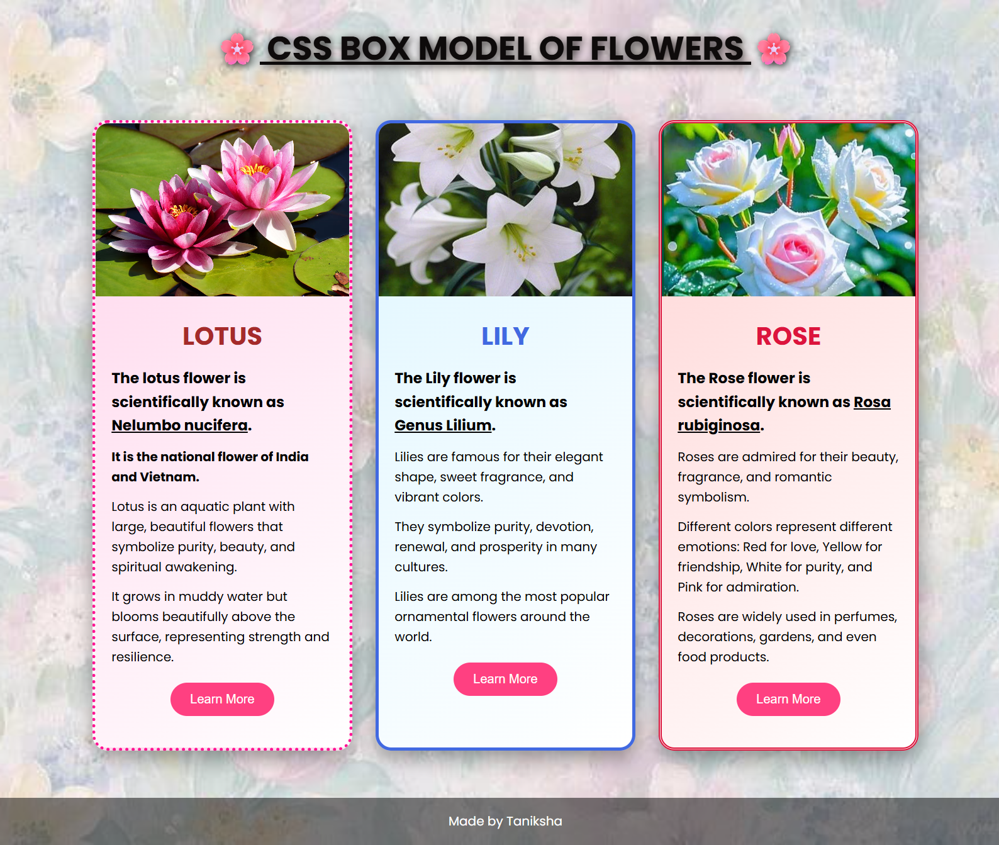

# CSS Box Model of Flowers
This is a simple HTML and CSS project demonstrating the CSS Box Model using flower cards.

## Features
- Responsive Design
- CSS Flexbox
- Hover Effects
- Background Image
- CSS Gradients
- CSS Box Model
- Modern UI

## Technologies Used
- HTML
- CSS

## Screenshot


## Project Structure
```
CSS-Box-Model-Of-Flower
|__index.html
|__style.css
|__README.md
|__flowerimages
    |__rose.png
    |__lotus.png
    |__lily.png
    |__backflower.jpg
|__screenshot1.png
```
    
## Author
Taniksha R. Nagpure
